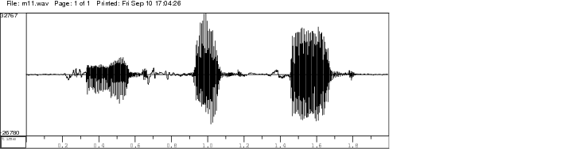
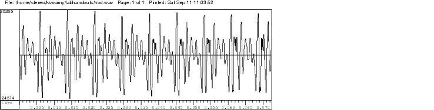
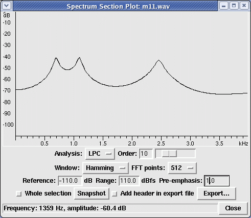

1.  Obtaining speech signal
    - Load speech signals for heed, head, hod using the provided utility.

2.  To obtain average pitch period

- Display the recorded speech waveform.

 

 
<b>Figure 1:</b> Speech waveform for the utterance "heed-head-hod". 

 

- Select the vowel segment. A segment of the vowel /i/ is shown in the Figure 2.

  
<b>Figure 2:</b> A part of the vowel /a/ in the speech segment of 'hod' 

- The quasi-periodic nature of prominent peaks shown in Figure 2 is due to the regular vibration of the vocal folds.

- Pitch period $T_{0}$ is measured as the interval between any two successive prominent peaks.

- The speech signal between two successive prominent peaks corresponds to one pitch cycle (i.e., one pitch period $T_{0}$).

- Note the time (in ms) of the pitch period for three or four pitch cycles (say) and measure the average pitch period $T_{0}$, preferably in the steady portion of the speech signal as illustrated in Figure 2.

- As pitch period $T_{0}$ is not constant over the entire vowel segment, make four or five pitch period measurements.

- The mean of these values gives the average pitch period $T_{0}$ and hence the fundamental frequency $F_{0}$:

  $$
  F_{0} = \frac{1}{T_{0}}
  $$

- The average pitch period $T_{0}$ can also be obtained from the autocorrelation sequence of the corresponding speech segments. Measure the distance between the peak at zero and the next prominent peak in either the positive or negative delays of the obtained autocorrelation sequence.

3.  To obtain formant frequencies

- Select the voiced segment of the recorded speech segment using the provided utility.

Figure 3 shows the LP spectrum obtained using Linear Prediction (LP) analysis of the voiced region of the speech segment /hod/ with LP order set to $10$.

  
<b>Figure 3:</b> LPC spectrum of a short segment of vowel /a/ in the utterance of 'hod'. 

- The spectrum is obtained using $10$th order LP analysis. As shown in the figure, the peaks of the LP spectrum represent the formant frequencies.

- The peaks of the LP spectrum shown in Figure 3 represent the resonant frequencies (also called formants) of the vocal tract.

- Repeat the above steps for recorded speech of all vowels.

- Repeat the above procedure for recorded speech of different speakers.
